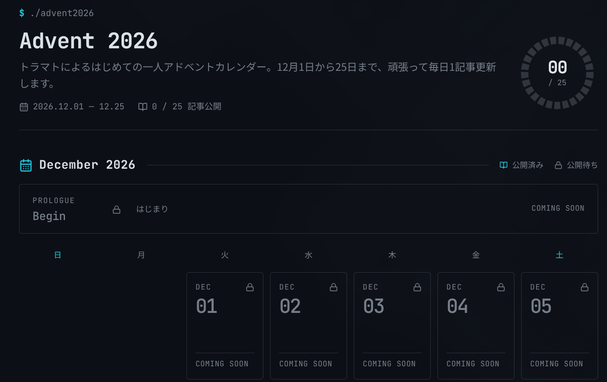

## はじめに

こんにちはトラマトです。

大学生になって2度目の冬ですが、なんと今年は**一人アドベントカレンダー**をやります！！

12/1から12/25まで毎日1本ずつ記事を公開していきます。25本です。バカかな？

僕のことを知らない人向けにざっくり自己紹介しておくと、電通大Ⅰ類CSプログラムの2年生で、個人開発やLinuxいじりをしている人です。詳しくはこちらをどうぞ。

https://note.com/toramutton/n/n338320294cf6

## アドベントカレンダーってなに？美味しいの？

もともとはクリスマスまでの日数を数えるカレンダーで、1日ずつ窓を開けるとお菓子が出てくる、みたいなやつです。

現代では、これにならって**12/1〜12/25に1日1記事ずつ公開していく企画**のことを指します。

大学1年生だった去年は、以下の2記事で僕も参加してました。

https://note.com/toramutton/n/n5b8dc1753330

https://note.com/toramutton/n/n7867a442b905

普通は何人かで日付を分担するんですが、それを全部1人でやる意味のわからない行為が**一人アドベントカレンダー**です。

## なぜ一人でやるのか

理由は大きく2つです。

### 先輩がやってた

MMA(サークル)の偉大なる先輩が数年前に一人アドカレを完走していて、それを見て「なんだこれ、完走したらめっちゃ楽しそうじゃね！？」ってなったのがきっかけです。単純。

ずらーっと25本もの記事が並んでいるのを見ると圧巻ですよね。僕もこの1年間で色々あったので、こういう形で残してみたくなりました。

### 今が（**相対的に**）一番ヒマな学年

電通大のⅠ類は、2年生が**比較的**ゆるい学年です。前期なんて毎週3連休でした（詳しくは[こちらの記事](/blog/uec-2s1-review/)）。

3年生になると実験や研究室のことで一気に忙しくなるらしいので、やるなら今しかなくね？？？ということで、勢いで始めることにしました。

……と言いつつ、この10〜12月は普通に資格勉強も課題もテストも~~米津玄師のライブも~~あるので、ちゃんと完走できるかは未来のトラマトさん次第です。マジで頑張れ！

## どんな記事が出るの？

タイトルは[Adventar](TODO)で公開済みです。ジャンルで分けると下のような感じですね。技術一色になりすぎないように結構考えまくって決めました。

| ジャンル                       | 本数 |
| ------------------------------ | ---- |
| 🛠 作ったもの                   | 6    |
| 🐧 Linux・開発環境             | 5    |
| ✍️ 書くこと・発信              | 4    |
| 🎓 大学・学び                  | 4    |
| 🗓 2026年の振り返り             | 4    |
| 🤖 その他(ローカルLLMと最終日) | 2    |

それと、今回のちょっとしたこだわりポイントがあります。記事の掲載先を**4つの媒体に散らしています。**

| 掲載先                     | 本数 |
| -------------------------- | ---- |
| このブログ（ローカル記事） | 11   |
| note                       | 8    |
| Zenn                       | 3    |
| Qiita                      | 3    |

技術記事はZennやQiita、ゆるい(？)話はnote、自分のことはこのブログ、みたいに内容に合わせて置き場所を選んでいます。

どの媒体の記事も[カレンダーページ](https://toramutton.me/advent2026/)でからまとめて飛べるようにしてあります。

## おわりに

というわけで、トラマト一人アドベントカレンダー2026、開始です！

1日目は **Arch Linux** の話からスタートします。また明日、12/1にお会いしましょう〜

<!-- TODO: Adventarのカレンダーを作ったらリンクを追加 -->

- [Adventarのカレンダー](TODO)
