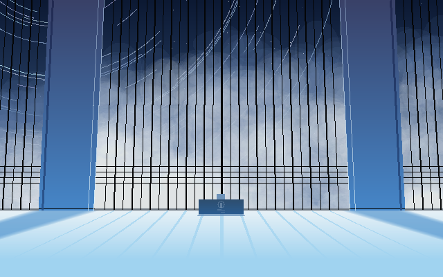
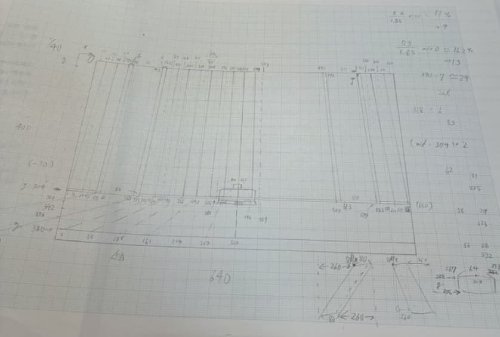
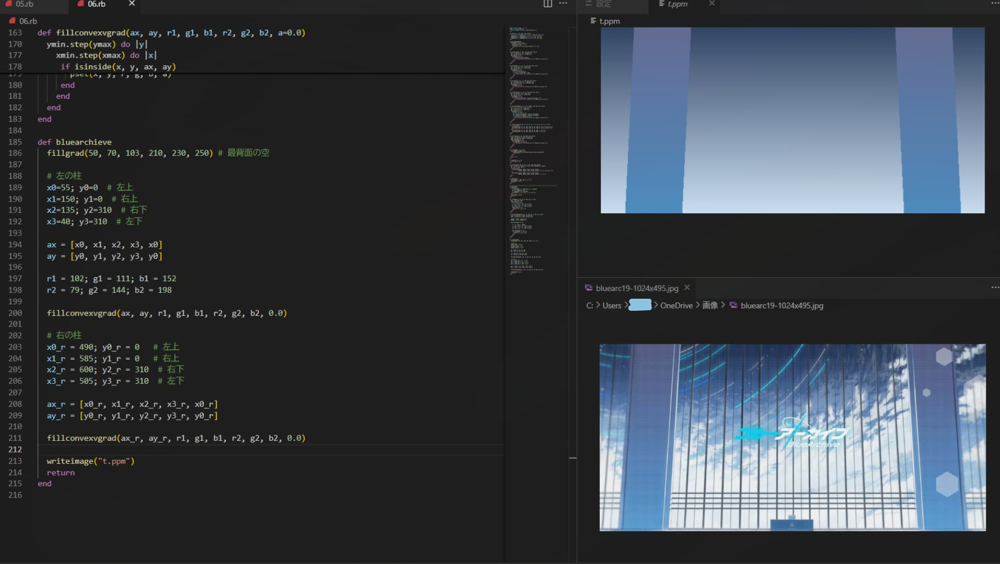
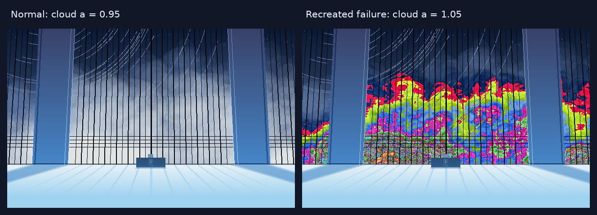

> この記事は[トラマト一人アドベントカレンダー](https://toramutton.me/advent2026/)の5日目の記事です。

## はじめに

こんにちはトラマトです。

今回は、Rubyのみでゲーム『ブルーアーカイブ』の背景を描くプログラムについて紹介します。

https://github.com/ToraMutton/ba-bg-ruby

実際に下のような画像を作ることができました。詳しい人はピンとくるかも？


_美しい〜_

ブルアカのタイトル画面の背景を再現しています。画像を読み込んで貼り付けているわけではなく、**空も雲も窓枠も、点や図形を塗って作りました。** 外部のgem（Rubyのライブラリ）も使っていません。

## これ、大学の課題です

### まさかのRuby

にしても、Rubyでこういう画像を描くのはちょっと意外かもしれません。でも電通大で「基礎プログラミングおよび演習」を履修した人なら、見覚えのある言語だと思います。

今回の元になったのは、1年生のときの画像生成課題。「Rubyの構造体を使って、好きに画像を作れ」というシンプルで自由な内容でした。そのソースコードをGitHubに公開したのが今回紹介するやつです。

### なんでこの絵を作ったの？

課題を行う上で、四角や楕円などの基本的な描画関数はかなり用意されていました。~~エクストリームスポーツ~~基礎科学実験もあったし、正直そんなに力を入れず、無難なものを完成させても良かったんですよね。

ただ、せっかくなら楽しいものを作ってみるか〜という軽いノリ、そしてもともとの「星空が好き」「ブルアカの背景絵のタッチが好き（もちろんキャラも好きですよ！！！）」という3要素によって作ることとなりました。単純……

あの綺麗でオシャレな背景を自分のコードで作れたら楽しそうだな〜という気持ちです。

### なんと、ほぼ生成AIを使ってない

今なら、こういうプログラムを作るときも生成AIにかなり相談すると思います。最近のモデル凄いですもん。

ただ、当時自分が触っていたのはGemini 2.5だけ。思い描いた絵になるように細かく調整するには、自分で考えて書くほうが進めやすかったんですよね。

というわけで、用意された描画関数を土台に、**座標や色の調整、足りない関数の追加はほぼ自力でやりました**🤡


_実際の設計図。窓枠から影まで座標を書き込みまくった_

まずグラフ用紙に設計図を描き、柱や窓枠の座標を決めて、コードに入力。画像を出しては数値を直す…という作業を繰り返しました。

土曜日を丸一日使って作りました。懐かしい……。今見返すとよくこんなに手で書いたな!?と思います。ちなみに課題は8点満点をもらえました。やったぜ

## どうやって描いたの？

ここからは、具体的にどう描画しているかを紹介します。（Rubyの記法、今見返すと独特だな……）

### 正体はRGB配列

画像の正体はただの**ピクセル（画素）の集まり**です。

このプログラムでは、1ピクセルの色を構造体で持っています。

```ruby
Pixel = Struct.new(:r, :g, :b)
```

`r`、`g`、`b`は赤・緑・青の値で、それぞれ0〜255。たとえば白は`(255, 255, 255)`、黒は`(0, 0, 0)`です。

これを縦400個、横640個の二次元配列に並べます。

```ruby
$img = Array.new(400) do
  Array.new(640) do Pixel.new(255, 255, 255) end
end
```

最初は全部真っ白な画像。この配列の`$img[y][x]`に入っている色を書き換えていくことで絵を描きます。

四角や楕円を描く関数も、内部では「図形の内側にあるピクセルを探して、その色を変える」という処理をしています。図形を描く機能まで、結局は点を塗る処理の集まりなんですね。

最後に色のデータを**PPM形式**のファイルに書き出せば、画像の完成です。GitHubに掲載しているPNG画像への変換は、別途ImageMagickで行っています。

### 順番に組み立てる

一見複雑な背景ですが、描くものを分解するとこうなります。

| 部分   | 描くもの             |
| ------ | -------------------- |
| 背景   | 空、星の軌跡、星、雲 |
| 構造物 | 窓枠、柱             |
| 前景   | 床、光、影、机と椅子 |

これらを**奥にあるものから手前のものへ**順番に重ねて描きます。お絵描きソフトのレイヤーに近い考え方ですね。

ただし、別々のレイヤーを保存する偉大な機能なんてありません。同じ画像に順番に描き込んでいるので、雲を描いてから窓枠を描けば、窓枠が雲の手前に見えます。絵描き大発狂案件かもしれない。


_空と柱だけだった頃。右下の参考画像を見ながら少しずつ作ってて、当時はまだVS　Codeを使ってますね🤡_

この状態から窓枠、床、影……と追加していくと、だんだん求めてた背景になっていきます。出力画像が変わるたびに「近づいてきておお！」となるのが楽しかった。

### 星の軌跡は自作の円弧

用意された図形だけではどうしても足りなかったものの一つが、空に伸びる**星の軌跡**です。

ここはドーナツ型の図形を描く関数を改造して、円弧を描けるようにしました。

まず、中心からの距離を調べてドーナツ型の範囲にある点を探す。さらに、その点が指定した角度の範囲にあるかを調べます。中心からの角度を求めるのに使ったのが`Math.atan2`です。

```ruby
# 円弧の描画処理から抜粋
d2 = (i - cx)**2 + (j - cy)**2
if r2**2 <= d2 && d2 <= r1**2
  angle = Math.atan2(j - cy, i - cx)
  if angle >= theta1 && angle <= theta2
    pset(i, j, r, g, b, a)
  end
end
```

要するに、**ドーナツを角度で切り取ったものが円弧**です。半径や長さ、色をランダムで変えて何本も描くことで星の軌跡らしくしています。数学、こういうところで役立つんですねぇ……

### 雲の正体は、大量の楕円

一番大変だったのは雲です。

楕円を1個置くだけだと、どう頑張ってものっぺりした楕円にしか見えません。そこで、**薄い楕円を位置や大きさを変えながら大量に重ねる**ことにしました。

```ruby
def cloud(cx, cy, cr, num, r, g, b, a)
  num.times do
    x = cx + rand(cr * 2.0) - cr
    y = cy + rand(cr * 2.0) - cr
    rx = rand(30) + 20
    ry = rand(30) + 15

    fillellipse(x.to_i, y.to_i, rx, ry, r, g, b, a)
  end
end
```

1枚1枚はほとんど見えないくらい薄くても、重なったところは濃くなります。これを数百回も繰り返すと、ふわっとした雲らしい濃淡が生まれます。

青い雲の上に白い雲を重ね、位置や透明度を何度も調整しました。正直ゴリ押しで処理時間もめちゃくちゃ長いけど、ちゃんとそれっぽくなるのが面白い。

位置や大きさはランダムなので、**実行するたびに違った雲になる**のも気に入っています。星の配置や軌跡も変わるので、毎回微妙に違う景色が出てきます。

### 大やらかし：虹色の雲が爆誕

この雲を調整しているとき、透明度の指定をやらかしました。

薄い白い雲を描きたかっただけなのに、出てきたのは**虹色のノイズ**。何事？？？


_当時の失敗画像が見つからなかったので、元コードの描画式をもとに再現。左が正常、右が雲の透明度を1.05にしたもの。_

このプログラムで色を混ぜる計算は、RGBの各成分について次のようになっています。

```text
新しい色 = 元の色 × a + 描く色 × (1 − a)
```

ここでの`a`は、**元の色をどれくらい残すか**です。

| a    | 色の混ぜ方             |
| ---- | ---------------------- |
| 0.0  | 元の色0％＋描く色100％ |
| 0.5  | 元の色50％＋描く色50％ |
| 0.95 | 元の色95％＋描く色5％  |
| 1.0  | 元の色100％＋描く色0％ |

雲は`a = 0.95`といった値で薄く描いていました。ところが、これを**1より大きい値**にしてしまったんです😨

すると`1 − a`が負になり、普通の色の混合から外れます。重ね描きするうちにRGBの値も本来の0〜255の範囲から外れ、画像に書き出す段階でこの世の終わりみたいな景色が完成しました。

単に**雲が薄くなるつもり**で数字を変えていたら大惨事。透明度という名前だけで判断せず、何を計算している値なのか理解しないとダメですね🤡

### 光と影の作り方

雲で使った**薄い図形を大量に重ねる**という発想は、影にも使っています。

柱の影を不透明な多角形1枚で描くと、輪郭がくっきりしすぎて狙った柔らかい影になりません。そこで、薄い影を**1ピクセルずつずらしながら20回重ねる**ことにしました。

```ruby
# 左の柱の影
20.times do |i|
  x = 43 + i
  ax = [x, x + 80, x - 180, x - 260, x]
  ay = [304, 304, 380, 380, 304]

  fillconvex(ax, ay, 81, 151, 211, 0.95)
end
```

重なりが多い部分は濃く、少ない端の部分は薄くなるので、輪郭がぼけた影のように見えます。本格的なぼかし処理を入れなくても、描き方の工夫で似たような表現ができるわけです。

空や柱、床に差し込む光には、グラデーションを描く関数も追加しました。上の色と下の色を決めて、ピクセルの高さに応じて少しずつ色を混ぜています。

窓枠や床の影も、線の始点と終点の間隔を変えて立体的な奥行きが出るように調整しました。厳密な光のシミュレーションではありませんが、元の絵を見ながら座標と色を合わせていくと、だんだんそれっぽくなります。

特に床に光と影が入ったときは、一気に部屋らしくなって「プログラミングで絵を描いてる！すげぇ！！」という実感がありました。ここまで来ると、机の小さな模様まで描きたくなっちゃうんですよね……

## おわりに

最初は「好きな背景を作ってみるか〜」という軽いノリでしたが、気づけばグラフ用紙に座標を書き込み、雲を何百枚も重ね、透明度を間違えて虹色パラダイスを爆誕させる課題になっていました。

単純な図形でも、**組み合わせと工夫次第で光や影のあるリアルな風景になる**、というところが作っていてかなり面白かったです。

もちろんRubyでピクセルを一つずつ塗り、楕円を何百回も描くので、処理はそれなりに重く書き出しに数秒かかります。今見れば整理したいコードもたくさんありますし。

それでも、ほぼ自力で数値を調整して一枚の絵を完成させた経験は、今の自分にとってかなり大事なものだったと思います。大学の課題も、好きなものを題材にすると急に楽しくなるんですねぇ。~~そのぶん時間も溶ける~~

3日目に紹介した[ArToram](https://artoram.toramutton.me/)では数式から模様を作りましたが、こちらは点と図形を積み重ねて風景を作った話でした。どちらも、コードを変えると目の前の絵が見事に変わるのが楽しいところです。

ソースコードはこちら。Rubyが入っていれば、以下のコマンドでPPM画像を生成できます。

https://github.com/ToraMutton/ba-bg-ruby

```bash
ruby ba_bg_gen.rb
```

ImageMagickも入っていれば、PNGに変換できます。

```bash
magick t.ppm output.png
```

それでは！！

> 明日（12/6）は「私のArch Linuxデスクトップができるまで」です！どのような大乱闘を経て今の形になったのか、お楽しみに
