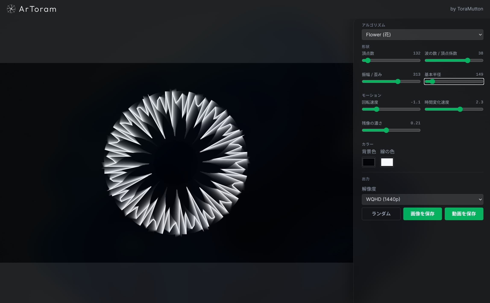
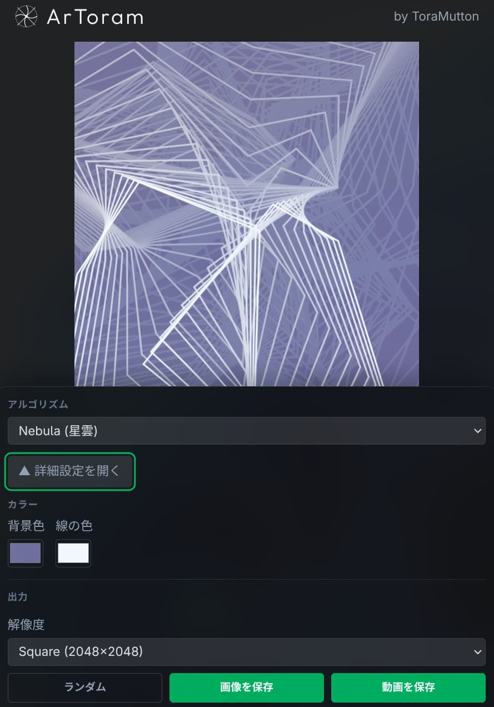
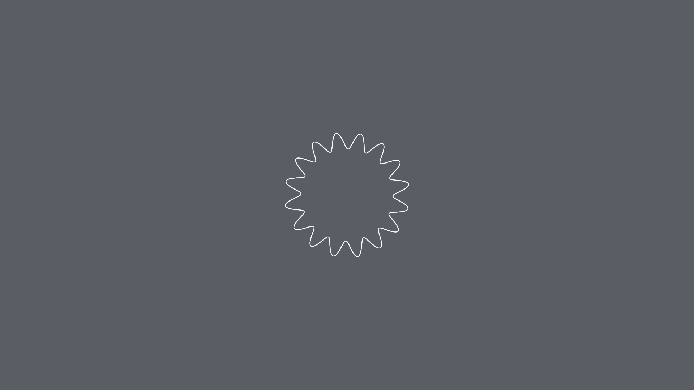
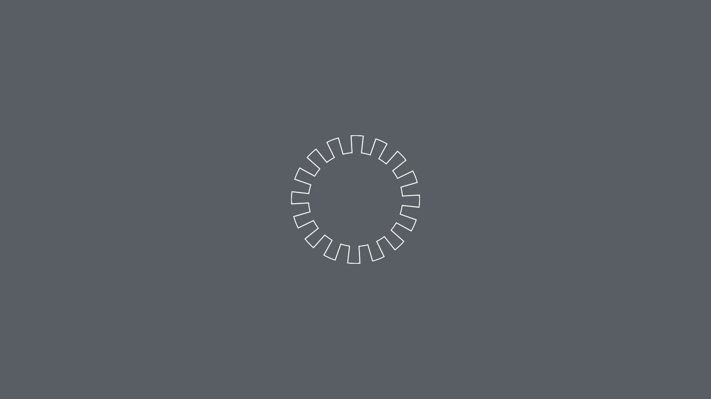
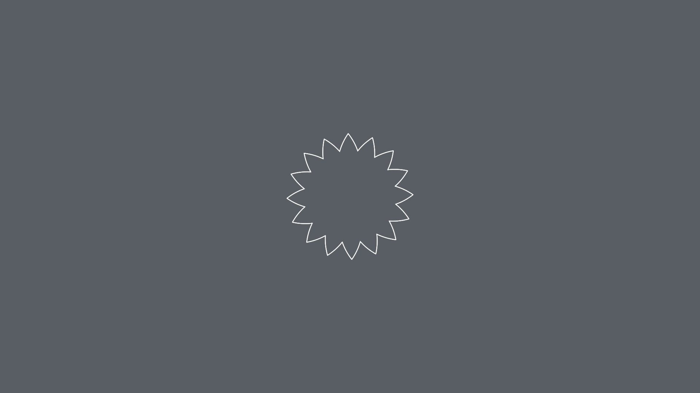
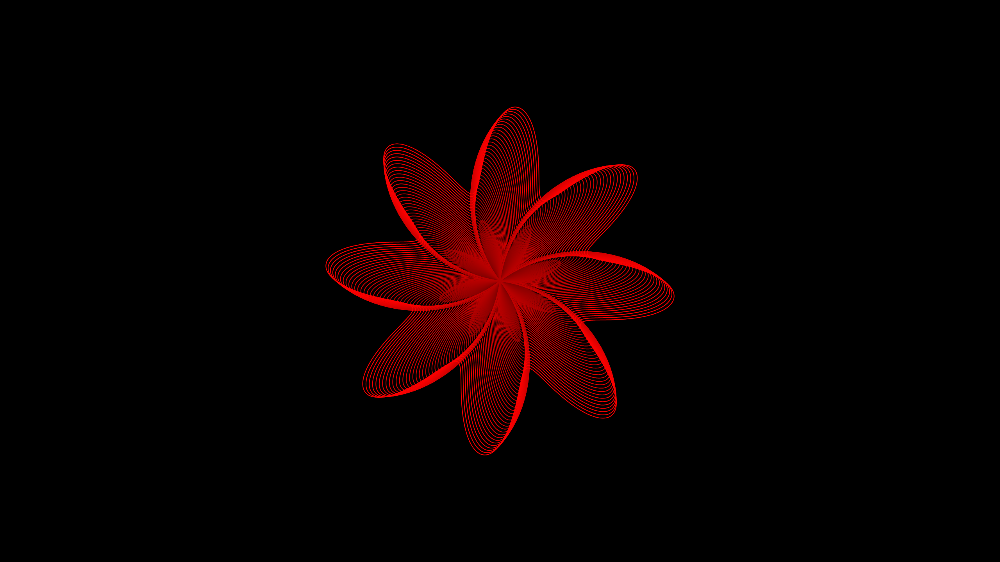
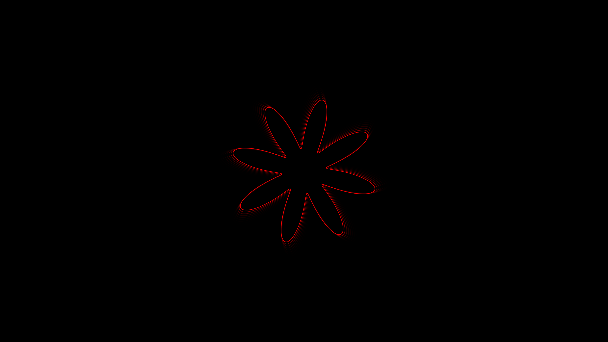
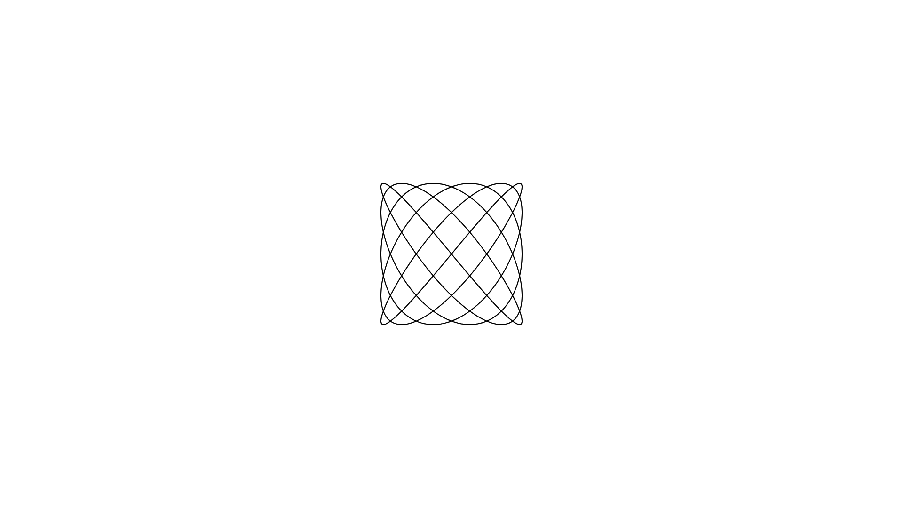

> この記事は[トラマト一人アドベントカレンダー](https://toramutton.me/advent2026/)の3日目の記事です。

どうもトラマトです。

今回は、自分が作った Web アプリ **ArToram（アートラム）** の話をします。

https://artoram.toramutton.me/

https://github.com/ToraMutton/artoram

この技術分野の世界にハマってから相当初期に作った作品です。今見ると「ここ雑やな〜」という部分もたくさんありますが、それも含めて開発記として残しておきます。

## ArToramってなに？

パラメータをいじりながら、動く幾何学模様を作って壁紙として保存できるツールです。


_PCでの見た目_


_スマホでの見た目_

URLにパラメータが全部入るので、気に入った設定ができたらそのままURLを投げつければ、別端末の画面でも同じ模様が再現されます。

## なぜ作ったの？

きっかけは[以前の記事](https://toramutton.me/blog/what-is-arch/)でも紹介したArch Linux です。デスクトップをカスタマイズすると、スクショを撮ってネットに上げたくなるんですよね。

ただ、壁紙にイラストを使っていると著作権が気になります。自分で描いていない素晴らしいイラストを、スクショとしてネットに上げていいのか…？と考え始めると、ちょっと著作権周りで怖いですよね。

そこで「**シンプルな壁紙を自分で簡単に作れるサイトがほしいんだよなあああ**」と思ったのが始まりです。

……と書いていて思ったんですが、自分の個人開発って全部「他の人に需要があるか」じゃなくて「**自分が欲しいかどうか**」で決まってるんですよね。性格があまりにも出すぎている

## 技術選定：深い理由はない

| 項目           | 使ったもの            |
| -------------- | --------------------- |
| フレームワーク | React 19 + TypeScript |
| ビルド         | Vite 8                |
| スタイル       | Tailwind CSS v4       |
| 描画           | Canvas API            |

正直に言うと、深い理由はあまりありません。なんせ初めての個人開発だったので、

- とにかくとっつきやすい **Web アプリ**にする
- 有名な **React + Canvas API** を使う

くらいの気持ちで決めました。まだ初心者だったので、「有名なもの使っておけば詰まっても何とかなんじゃね？」という判断です。

ちなみに開発初期は `geo-art-gen` という名前のリポジトリでした。この頃に勉強したことは Zenn にも書いています。懐かしい

https://zenn.dev/toramutton/articles/what-is-type

https://zenn.dev/toramutton/articles/const-in-switch

後者の switch 文の話は、まさにこのあと出てくる**20種類のアルゴリズムをswitchで切り替える部分**で踏んだ罠です。

## 描画のしくみ

### 円をゆがませるだけで模様になる

ArToram の描画は、ほとんどが「**円をゆがませる**」という発想でできています。

円は中心からの距離、つまり半径がどの角度でも同じ図形です。この半径を角度によって変えてやると、円が波打ったりトゲトゲになったりします。つまりあれです、数学ⅢCでやる極座標です。

コードにするとこんな感じです（説明用に一部省略）。

```ts
for (let i = 0; i <= currentParams.points; i++) {
    // angleが 0 から 2π まで一周
    const angle = (i / currentParams.points) * Math.PI * 2;

    let radius = currentParams.baseRadius; // 基本半径
    const t = time * currentParams.waveSpeed;

    switch (currentParams.mode) {
        case "Wave": // サイン波
            radius +=
                Math.sin(angle * currentParams.waves + t) *
                currentParams.waveHeight;
            break;
        // ...（残り19種類）
    }

    // 極座標 → XY座標に変換
    x = Math.cos(angle) * radius;
    y = Math.sin(angle) * radius;

    if (i === 0) ctx.moveTo(x, y);
    else ctx.lineTo(x, y);
}
```

式で書くと `r(θ) = R + A × f(nθ + t)` です。`R` が基本半径、`A` が振幅、`n` が波の数、`t` が時間で、`f` が「どんな波でゆがませるか」を決める関数です。

面白いのは、**この `f` を入れ替えるだけでまったく別の模様になる**ところです。

| モード    | f(x)                  | 見た目                                 |
| --------- | --------------------- | -------------------------------------- |
| Wave      | `sin x`               | なめらか〜に波打つ                     |
| Chaos     | `tan x`               | 無限大に吹っ飛んで、鋭いトゲトゲになる |
| Gear      | `sign(sin x)`         | 矩形波で、カクカクした歯車になる       |
| Snowflake | `(2/π) × asin(sin x)` | 三角波で、とがった枝になる             |
| Crystal   | `abs(sin x) − 0.5`    | 角ばった面になる                       |


_Wave_


_Gear_


_Snowflake_

Gear と Snowflake は、`sin` を加工して矩形波・三角波を作っています。応用数学でやる信号処理の授業で見る(かもしれない)波形が、そのまま図形の形になるのが楽しいポイントです。

### XY を直接計算するモード

一方で、Lissajous・Heart・Epicycloid・Hypocycloid の4つは極座標を使わず、**x と y を直接計算**しています。

```ts
// 極座標からXYへ変換しない(直接x,yを計算する)モード
const isDirectXYMode =
    currentParams.mode === "Lissajous" ||
    currentParams.mode === "Heart" ||
    currentParams.mode === "Epicycloid" ||
    currentParams.mode === "Hypocycloid";

if (!isDirectXYMode) {
    x = Math.cos(angle) * radius;
    y = Math.sin(angle) * radius;
}
```

中心からの距離では表しにくい図形は、こちらの方式で描いています。

### 残像は「消さない」ことで作る

ArToram の模様は、線が尾を引くように残像を残しながら動きます。これは**前のフレームを完全には消さない**ことで作っています。

```ts
ctx.fillStyle = `rgba(${hexToRgb(currentParams.bgColor)}, ${currentParams.fadeOpacity})`; // 残像効果
ctx.fillRect(0, 0, w, h); // キャンバス全体を指定色で塗りつぶす
```

普通のアニメーションでは毎フレーム `clearRect` で画面を消しますが、ここでは**半透明の背景色**を上から塗っています。

たとえば残像の濃さが 0.22 なら、前のフレームは 78% だけ残ります。10フレーム後には約8%まで薄くなるので、古い線ほど背景に溶けていくわけです。同じ図形でも残像でこんなに変わります。


_残像が0.01のとき_


_残像が0.5のとき_

## 校章を入れたかった：リサジュー図形

実はArToramを作るときに、これだけは絶対に入れたいと思っていた図形があります。**リサジュー図形**です。

電通大の校章はリサジュー図形がモチーフになっています。大学の公式ページによると、周波数比は **5:6** で、これは東日本の商用電源 50Hz と西日本の 60Hz に対応しているそうです。~~2025年度の数学の入試問題にも出てた~~

- [電通大の校章について](https://www.uec.ac.jp/about/profile/emblem.html)

ArToramのLissajousはこうなっています。

```ts
case 'Lissajous': // リサジュー図形
  // 媒介変数表示
  x = currentParams.baseRadius * Math.sin(currentParams.waves * angle + t);
  y = currentParams.baseRadius * Math.sin((currentParams.waves + 1) * angle);
  break;
```

x と y の周波数比が `波の数 : 波の数 + 1` なので、**波の数を 5 にすると 5:6、つまり校章と同じ比率**になります。


_ちゃんと作れる_

で、リサジュー図形を入れたら「他の数学的な曲線も入れたいな〜」となり、バラ曲線、エピサイクロイド、ハート……と増やしていったら、気づくと20種類になっていました。

## いちばん苦労したこと：Safari がクラッシュする

解像度の切り替えは特に問題なかったんですが、一番大変だったのは **Safari でのクラッシュ**です。

スライダーをどりゃーっと高速で動かしていると、タブごと落ちて真っ白になることがよくありました。原因になっていたのは主に次の3つです。

| 原因                                                     | 対策                           |
| -------------------------------------------------------- | ------------------------------ |
| スライダーを動かすたびに URL を書き換えていた            | URL 更新を 300ms デバウンス    |
| パラメータが変わるたびに Canvas のサイズを再設定していた | サイズが変わったときだけ再設定 |
| 動画をフル解像度で書き出していた                         | 長辺を 1280px に制限           |

ちなみにiOS版Chromeも基本中身はSafariと同じWebKitなので、同じように落ちます。

### URL 更新のデバウンス

URL 共有のために、パラメータが変わるたびに `history.replaceState` で URL を書き換えています。スライダーを動かすと、これが毎フレームのように連打されていました。

```ts
// URL更新はデバウンスする（スライダー操作中に history.replaceState を連打すると
// iOS の WebKit(Safari/iOS版Chrome共通)でメモリが解放されずクラッシュすることがあるため）
const timeoutId = setTimeout(() => {
    const p = new URLSearchParams();
    Object.entries(params).forEach(([key, value]) => {
        p.set(key, String(value));
    });
    window.history.replaceState(null, "", `?${p.toString()}`);
}, 300);

return () => clearTimeout(timeoutId);
```

`useEffect` のクリーンアップで前のタイマーを消しているので、スライダーを止めてから 300ms 経ったときに1回だけ URL が更新されます。

### Canvas のサイズ再設定を減らす

`canvas.width` / `canvas.height` への代入は、**描画バッファを破棄して作り直す**超重い処理です。同じ値を代入しても作り直されます。

最初はパラメータが変わるたびに無条件で代入していたので、前回のサイズを覚えておき、変わったときだけ代入するようにしました。

```ts
const lastSize = lastCanvasPixelSizeRef.current;
const nextPixelW = Math.round(canvasW * dpr);
const nextPixelH = Math.round(canvasH * dpr);
const sizeChanged =
    !lastSize || lastSize.w !== nextPixelW || lastSize.h !== nextPixelH;

if (sizeChanged) {
    canvas.width = nextPixelW;
    canvas.height = nextPixelH;
    ctx.setTransform(dpr, 0, 0, dpr, 0, 0);
    lastCanvasPixelSizeRef.current = { w: nextPixelW, h: nextPixelH };
    // ...
}
```

### 動画は解像度を下げて書き出す

動画書き出しは、選んだ解像度のCanvasを5秒間エンコードし続けるので、PNG保存よりずっとメモリを使います。

4K のまま録画するとモバイルSafariではほぼ確実に落ちたので、アスペクト比を保ったまま長辺 1280px に縮小しています。

```ts
const MAX_VIDEO_DIMENSION = 1280;

const { w: targetW, h: targetH } = RESOLUTIONS[params.resolution];
const videoScale = Math.min(
    1,
    MAX_VIDEO_DIMENSION / Math.max(targetW, targetH),
);
```

## 振り返りと今後

かなり初期に作った作品なので、今見ると未完成な部分もたくさんあります。UIも不十分ですし。

それでも、

- 自分が欲しかったものを、一旦デプロイまでちゃんと形にできた
- 数学の式がそのまま絵になる楽しさを知れた
- Safariのクラッシュと格闘して、ブラウザのメモリを意識するようになった

という意味で、自分にとってはかなり大事な作品です。Arch Linuxのスクショにも役立ちまくってます。

今後やってみたいのは**3D 風の表現**です。今は円を基準にした平面的な模様しか作れないので、奥行きのあるオシャンティーな模様が作れたらもっと自由度が上がるはずです。いつになるかわからないですが💦

みなさんもぜひ自分だけの壁紙を作ってみてください〜

https://artoram.toramutton.me/

それでは！！

> 明日（12/4）は「Windows 11とArch Linuxをデュアルブートする生活とは」です！普段どう使ってるかを大公開します
