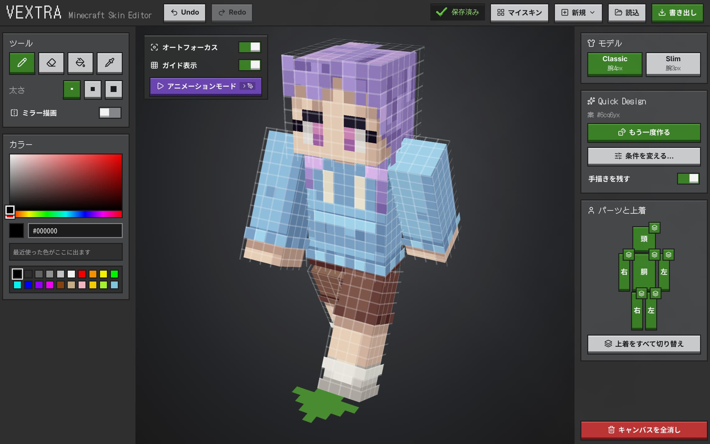
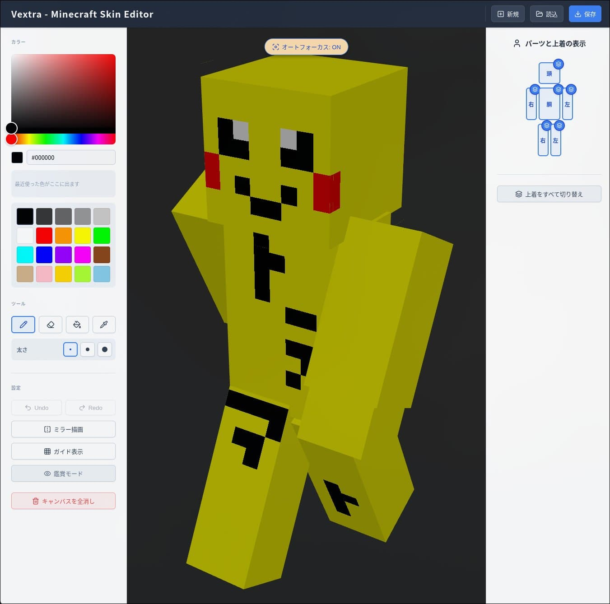
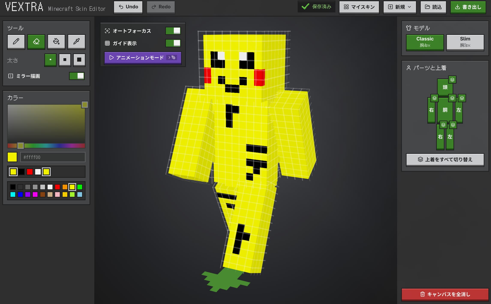
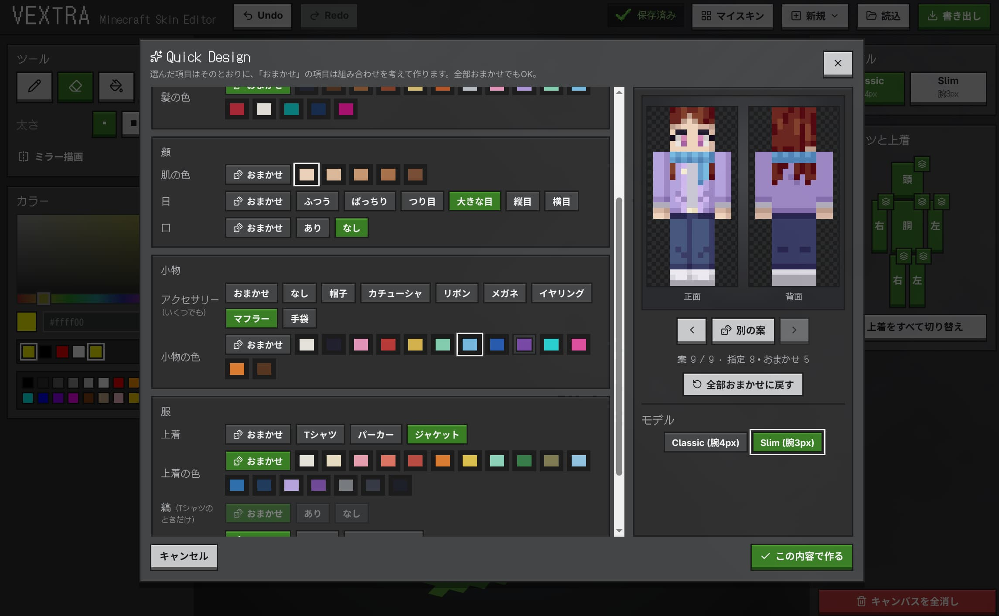
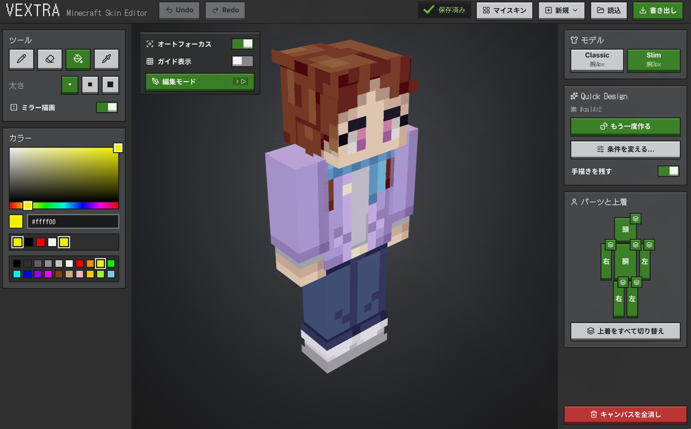

> この記事は[トラマト一人アドベントカレンダー](https://toramutton.me/advent2026/)の7日目の記事です。

## はじめに

こんにちはトラマトです。

今回は私の個人開発の一つである、ブラウザで動くMinecraftスキンエディタ **Vextra（ベクトラ）** の話をします！

https://vextra.toramutton.me/

https://github.com/ToraMutton/minecraft-skin-editor

ブラウザ上で3Dモデルをグリグリ回しながら、直接ペンで色を塗って自分好みのスキンを作れるWebアプリです。

_現在のVextra。自分用に作り始めたはずがかなり育ってた_

今年の4月頭に初期版を作ったのですが、半年経った10月に**「流石にUIも機能も妥協できん😭！！」**となって超絶大改造しました。

まずは動いている様子を見てくれ！！

<!-- TODO: 限定公開の操作動画をアップロードし、URL単独行に置き換える -->

## なぜ作ったの？

発端はめちゃくちゃ単純で、「自分だけのオリジナルスキンでマイクラを遊びたい！」と思ったことでした。

もちろん世の中には素晴らしい既存のスキンエディタがたくさんあります。ただ、実際に触ってみると、

- ボタンやメニュー、広告が多すぎてどこを押せばいいか分からない
- 展開図と3Dがごちゃついてて「今どこの面を塗ってるんだ…？」と迷子になる
- もっとシンプルに、サクサク直感的に描きたい……

と、不器用な自分はかなり操作に戸惑ってしまったんですよね。

そこで私の脳内に舞い降りた狂気的な解決策がこちら。

**「使いやすいエディタがないなら、エディタごと自作すればいいじゃない」**

……はい。**スキンを作りたいだけだったのに、気づいたらスキンを作るための巨大なWebアプリを作り始めていました。** 目的と手段が逆転するオタク特有のやつです。寄り道の規模がおかしい🤡

[3日目のArToram](https://toramutton.me/blog/make-artoram/)でも「欲しい壁紙のためにジェネレーターを作ったぜ！」ってのが発端でしたが、私の開発モチベーションの99%は「自分が欲しいから」で動いていますね...

## 半年前の自分を殴り倒す大改造

最初のバージョンを勢いでデプロイしたのは今年の4月でした。

_4月時点。動いたときは感動したけど、今見ると……うん……_

当時は「うおおお！3Dモデルに色塗れた！！動いた！！！」と大はしゃぎしていたんですが、半年後に冷静に見返してみると、

**漂う「生成AIに言われるがまま作ったテンプレートUI」感**

が凄まじかったんですよね。

自分の作品だから容赦なく言いますが、ボタンの配置もぎこちないしデザインAI全任せだし、決して「使いやすい！」と胸を張れる仕上がりではありませんでした。

そこで10月、**自分が本当に使いたくなるエディタ**を目指して大改造に着手しました。

_現在。UIも中身も完全に別物へ進化！_

「描くときに何が見えていれば迷わないか？」をとことん突き詰め、以下の機能を一気に叩き込みました。

| 変えたところ               | できるようになったこと                                                                             |
| -------------------------- | -------------------------------------------------------------------------------------------------- |
| **画面デザイン・操作感**   | ツールバーを整理。塗りたい面やピクセルがハイライトされ、迷子を撲滅。ついでにマイクラ風にもしてる。 |
| **新規作成の柔軟化**       | デフォルト素体や白紙などから爆速スタート                                                           |
| **マイスキン（保存管理）** | 複数作品の保存、複製、リネームに対応。IndexedDBでローカルに自動保存                                |
| **Classic / Slim両対応**   | 腕の太さ（4px / 3px）の切り替え＆相互変換に対応                                                    |
| **Quick Design**           | 後述。                                                                                             |
| **テストの導入**           | 描画や変換ロジックの単体テスト（Vitest）に加え、PlaywrightでE2Eテストも完備                        |

特にマイクラ風デザインはかなり気に入ってます。ボタンの押し心地がサイコ～

## 3Dモデルに直接描ける仕組み

技術的な構成はこんな感じです。

| 役割           | 使っているもの        |
| -------------- | --------------------- |
| フロントエンド | React 19 + TypeScript |
| ビルド         | Vite                  |
| 3D描画・操作   | Three.js              |
| アニメーション | GSAP                  |
| ローカル保存   | IndexedDB（idb）      |
| テスト         | Vitest / Playwright   |

マイクラのスキンデータは、要するに**64×64ピクセルのちっぽけなPNG画像**です。頭・胴体・手足のテクスチャが1枚の画像にペタッと展開図のように敷き詰められています。

_実際の展開図。ちっちゃ。_

昔ながらのエディタだと「展開図のこの四角が右腕の裏側で……」と脳内変換しながら塗る苦行を強いられるんですが、Vextraは**3Dモデルの表面をクリックした瞬間に裏の画像へ色を転写**しています。

1. **Raycaster** で、クリック位置から伸ばした仮想的な線が3Dモデルのどのポリゴンに衝突したかを判定
2. 衝突点の **UV座標**（3Dモデルの表面に対応する画像上の座標）を割り出し、64×64画像の何行何列目のピクセルかを計算
3. そのピクセルに色を上書きし、Three.jsのCanvasTextureを再描画

……と、偉そうに解説しましたが、**複雑な数学やThree.jsの描画処理の泥臭い実装はClaudeに相当助けてもらいました**🤡

コード内には自分でも「ナニコレ？」となるような計算式が存在していますが、ちゃんと動いてくれているのでClaude大先生には頭が上がりません。

## 白紙の絶望を救う「Quick Design」

今回の大改造で一番のお気に入り機能が **Quick Design** です。

ドット絵を描いたことがある人なら分かると思うんですが、**真っ白なキャンバスを目の前にしたときの「何から描けばいいか分からん！」という絶望感**ってとんでもないじゃないですか。

そこで、「質問にポチポチ答えるだけで、いい感じのたたき台スキンを自動生成してくれる機能」を作りました。

_性別、髪型、服の系統などを選ぶだけ。めんどくさければ全部おまかせも可能_

_生成結果。服や髪の外側レイヤーも使って立体感が出るように工夫_

最近のAIの画像生成みたいに一発で完璧な絵を出力するのではなく、**70点くらいの土台を作って、気になるところは自分でペンを持って直す**というワークフローが一番楽しいし挫折しないと思うんですよね。

具体的な実装方法は、髪型や服などの各描画ルールと乱数を組み合わせて生成しています。

何もないゼロから描くのは辛いけど、服の色を変えたり前髪をちょっと足したりするだけなら誰でもできる。この**最初の一歩のハードルを極限まで下げる**のが、Quick Designの狙いです。

## Claudeとの開発：人間は何をしたのか？

今回の大改造、実装コードの大部分はClaudeに書いてもらいました。

じゃあコーディングがポンコツな自分は何をしていたかというと、**画面設計・データ構造・操作フロー・テストケースの言語化**に全精力を注ぎ込みました。

AIとの開発で一番やっちゃいけないのが「なんかいい感じにスキンエディタをリニューアルして～！」という丸投げです。これをやると、4月の自分のように**なんか動くけどコレじゃないテンプレート**が爆誕します。

- 自動保存と言っても、どのタイミングでIndexedDBに書き込むのか？
- 画面をリロードしたとき、未保存警告はどう出すのか？
- Slim（腕3px）からClassic（腕4px）に変換するとき、余白の1pxはどう補完するのか？
- ユーザーが一番気持ちよく感じるカメラの回転速度とズーム限界はどこか？

こういう**自分が欲しい体験を具体的な言葉にしてプロンプトに落とし込み、Claudeと壁打ちしながら仕様を固めて実装してもらう**。

実装がAIに任せられる時代だからこそ、「何を作りたいの？」「どこにこだわりたいの？」を設計する人間の役割が重要なんだな……と痛感しました。

3月に参加した技育祭で聞いた「より良いものにしたい、という熱意は人間にしか出せない」を、数ヶ月を経て体感しています。成長したのか...？

## まだまだ盆栽は続く

大改造を経てかなり理想のエディタに近づきましたが、まだまだやりたいことは山積みです。

特にQuick Designのバリエーションはもっと増やしたいし、将来的には[2日目のfxtwitter-bot](https://github.com/ToraMutton/fxtwitter-bot)のように、ローカルLLMやAPIを組み込んで「サイバーパンク風の服にして！」とテキストで指示したらパーツを描き足してくれるような機能も妄想しています。むずそうだけど

「スキンを作りたい」から始まったはずなのに、気づけばエディタという道具を育てる楽しさにどっぷり浸かってしまいました。~~あるあるですね~~

ブラウザさえあれば誰でも完全無料で動くので、マイクラをやっている人はぜひ自分だけのスキンを作ってグリグリ回して遊んでみてください！！

https://vextra.toramutton.me/

（※作品は使っているブラウザ内（IndexedDB）に保存されるので、完成したら念のため「PNG書き出し」で手元に保存しておくのをオススメします！PCが死んだらデータ消えます！）

それでは！！

---

> 明日（12/8）は「初心者を置いていかない技術記事の書き方」です！いつも記事や本を書くときに意識している言語化のコツを語ります。
