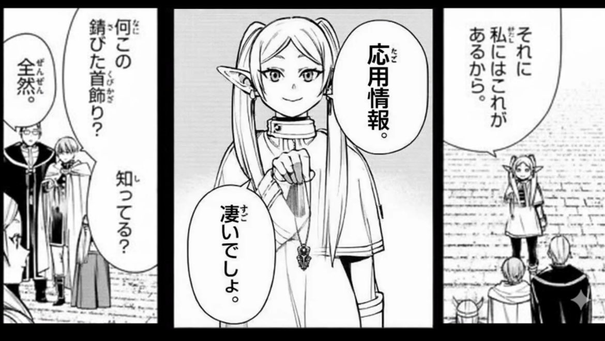
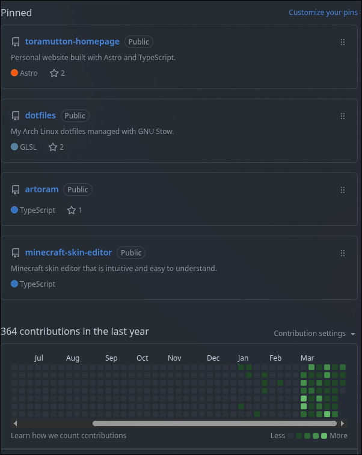
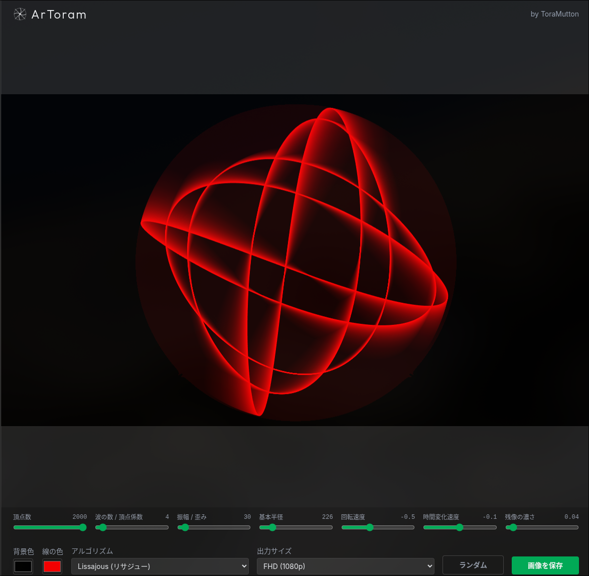
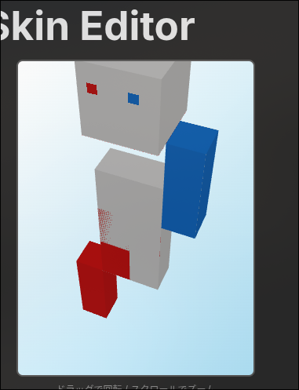
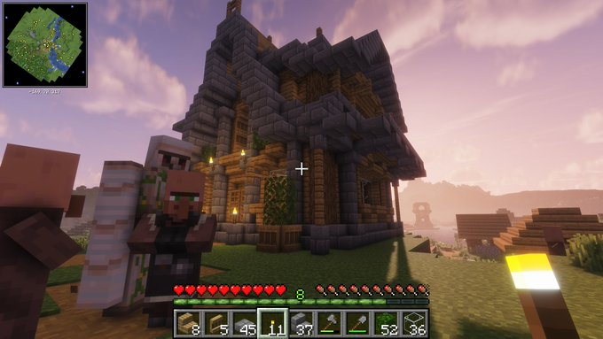

## なが〜い春休み

こんにちは、UEC25のトラマトです。
中高と比較して圧倒的に長かった大学生の春休みもそろそろ終わりそうですね。

期間で言うと**2/14〜4/7の2ヶ月弱**。
ちなみに電通大の春休みは世間一般的には短い方らしいです。本当に？？

今回の春休みは、ただ長かっただけじゃなくて**資格・開発・進路の全てが少しずつ繋がった時間**でした。
ということで気ままな振り返りではあるんですが、B2に向けた助走としても非常に意味のある春休みとなったのでまとめてみようと思います。

## 学業

### 基本情報技術者試験

一番デカいのはこれかな…？

期末テストが終わってからすぐ対策しようと思っていたんですが、自作PCが楽しすぎて春休み入ってからも実はしばらくできていなかったんですよね。
仕方ない、本当に世界が変わるレベルのマシンだったので😭

それでも結果的には合格できたのでOKということで！

にしてもマネジメント分野とストラテジ分野が初めて学ぶ学問で苦戦しましたね。
でもそれのおかげで、昔からぼんやり持っていた

> **会社内で使う知識ってどこで学ぶんだろう？** 

という疑問が少し解消されて嬉しかったです。

次は流れで**応用情報技術者試験**も取っておきたいですね。

どうやら2027年度から応用情報が大きく変化するらしいです。ややこしくなりそうなので今年中にとってフリーレンみたいになりたいですね…

### 大学のお勉強

数学とか英語の勉強は**皆無**でした。

期末テストのあの頑張りはどこいったんだってレベルで何もしませんでした。
でも目標GPA達成したから許して…

とはいえ、B2からは学問の専門性が高まるらしいのでかなりワクワクしてます。

そういや春休み中に、希望プログラムを**メディア情報学**→**コンピュータサイエンス**に変更しました。
興味分野をしっかり調べ直したことに加えて、後で書く[技育祭](#技育祭)で刺激を受けたのが理由です。

あと英語、どうやら**TOEIC**が卒業要件に絡むみたいですね。いきなりすぎる😥

## PC周り・技術

### 自作PC

無事完成しました〜

今まさにこのブログも自作PCで書いてます。詳しい性能や制作ログは[こちら](https://toramutton.me/blog/pc-build-2026/)にまとめています。

完成してから2ヶ月弱経ちましたが、重いゲーム、開発、改造、何をやっても快適！かなり理想の開発環境になりました。
あと数年はバリバリ全力で動いてくれそう。壊れるなよ〜

### iPad

そして春休み終了直前、**iPad Air M4**が着弾しました。

春休みのラストが新デバイスとはなんともエモな展開ですね。これで授業ノート、UIラフ、お絵描き、アイデア整理までかなり快適になりそうで楽しみです。

### 技術スキル

ここはかなり成長できた実感があります。

Linux、TypeScript、Gitなど、去年の自分からしたら「何これ難しそうすぎねぇ？？？」で止まってた領域でした。
でも実際に触ってみると、今の時代すぐ生成AIに聞けるので昔より格段に挑戦しやすい！

だから最近は、最初からスキルを持っていることよりも

> **知らないことを全力で楽しめる知的好奇心**

の方が圧倒的に大事だな〜と思っています。
楽しんでいるうちに技術力があとから付いてくる状態が最高ですね👍️

## 技育祭

技術系イベントっていうんですかね、初めて参加したのですが良い刺激とモチベになりました。
**生ひろゆきとラムダ技術部**を見られたのもアツすぎでした。

特に印象に残ったのは、AI時代の中で自分たちの就職や立ち位置はどう変化すのか？という問い。
ここをかなり深〜く考えられたのが大きかったです。

自分の中では最終的に、

- 人間が存在する限り問題は生まれる
- それを解決する仕事はAIが進化しようと消えない
- ただ**特定の何か1つだけ**に依存するのは危ない
- 問題解決の全プロセスを理解して組み合わせられる人が強い
- だから今はAIを逆に利用して幅広い技術分野に触れるべき
- 更にアカデミックなコンピュータサイエンスも学ぶと強い

という結論に落ち着きました。これがコンピュータサイエンス寄りに進みたいと思った理由の1つですね。

楽観しすぎず、悲観しすぎず残りの大学生活進んでいきたいです。

それと、技育祭で引いた**文字化けおみくじ**の記事がZennでかなり好評なので良ければ見てね〜〜〜

https://zenn.dev/toramutton/articles/garbled-omikuji

## 作品

せっかく時間あるんだし何か便利なもの作ってみたいな〜ってことで、**TypeScript** と**React**を使って2作品を作りました。

### 1. ArToram

[**ArToram**](https://artoram.toramutton.me/)

Arch Linuxの設定公開記事などを書くときなどに、著作権フリーの壁紙を自動で作れたら便利だなと思って制作しました。

今は円形を基本とした回転描画しかできないので、もっと様々な幾何学生成を加えていきたいですね〜

### 2. Vextra

[**Vextra**](https://vextra.toramutton.me/)

マイクラのスキンを自作したかったのですが、既存のエディタは使いにくすぎたのでエディタごと自作しました。

開発途中でMODでしか見ないバケモノが爆誕してビビりましたね。**関数名は間違えないようにしましょう(自戒)**

## 趣味

### ゲーム

自作PCのえげつないスペックのおかげで、消滅しかけてたAPEXなどのゲームに復帰しました。

**でも180fps出ても上手くはならなかった！！！！**

対戦ゲーはまぁ仕方ないとして、Minecraftで**影MOD×地形MOD×描画距離爆増MOD**入れてもストレスフリーでプレイできるのが流石に凄すぎた。
夏には描画エンジンが**OpenGL→Vulkan**になって更に軽くなるらしいから震えてます。一体どうなっちゃうんだ！？

### 映画・アニメ

あと **超かぐや姫！** や **暗殺教室** といった映画、**呪術廻戦**、**グノーシア**、**葬送のフリーレン**、**Dr.Stone** などの素晴らしい作品も楽しみましたね。
春休み時間あったわりにはそんな見れてないな？？？

### Twitter

趣味なのか？という疑問はありますが思い返すと春休みもずっとツイートしてましたね

3月からは26生が入ってきてとても賑やかになった感じがします。後輩に過去のキチガイツイートが発掘されて怯えています。許して…

## 総評

B1の春休みを簡単にまとめると、

**好きでやったことが、技術にも進路にも繋がった春休み**

ですね。

- 資格
- 開発
- 進路
- デバイス
- 趣味

をどれも想像以上に楽しめた2ヶ月弱でした。

期末テストでギャーギャーツイートしてた春休み前よりは大分変化した…はず？

いよいよB2が始まりますね。この春休みで広げた楽しさをもっと深くする1年にしたいです。

コンピュータサイエンス寄りの授業も本格化していくので、B1後期を越えたならなんとかなるやろ！という謎の自信で進んでいきます。それでは〜
