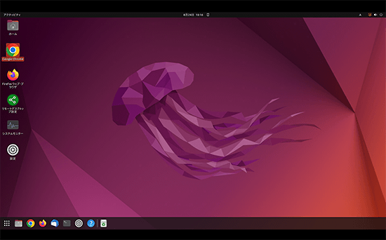

> この記事は[トラマト一人アドベントカレンダー](https://toramutton.me/advent2026/)の1日目の記事です。

## はじめに

こんにちは、トラマトです。
一人アドカレの記念すべき初日のテーマは **Arch Linux**です。
たまに自分がツイートしてるやつです。ちなみにおいしくはないです。


_Arch Linuxのロゴ、かっこいい_

今この記事もArch Linuxで書いていますが、この1年で一番作業環境と生活を変えてくれたのは間違いなくこいつでしたね。

この記事は、Linux未経験の人でも「感動〜！Archってこういうやつなのね〜！」と雰囲気で理解できるように書いています。

ちなみに細かい**インストール手順は書きません**（ググれば素晴らしい記事がたくさんあるので...）

## そもそもLinux / ディストリビューションとは？

まず前提をサクッと整理します。

- **Linux**：OSの心臓部にあたる**カーネル**。車でいうと**エンジン**。
- **ディストリビューション（ディストロ）**：カーネルに様々なソフトを組み合わせて、使えるOSにしたもの。車でいうと**車種**。

同じエンジンでも車種が違えば乗り心地は別物になります。Ubuntu、Fedora、Debian、そして今回のArchは、どれも**Linuxエンジンを積んだ別々の車**です（大学のPC室で使うUbuntuもその一つ）。


_~~コンリテ等の~~電通大の授業で使うUbuntu_

馴染み深いWindowsやiOSは、カーネルそのものが違う感じですね。

## Arch Linuxの特徴、3選

Archの特徴というと、以下の3つが代表的ですね。

### ① 最小構成から自分で組む

Archのインストール直後は、**驚くほど何もありません**。GUIもなければブラウザもない。真っ黒なターミナルがポツンとあるだけです。

UI、Wi-Fi管理、音を鳴らす仕組みまで、全部「自分で選んで入れてやるぜ〜」がArch流。完成品の既製PCを買うのではなく、**パーツを選んで自作PCを組む感覚**に近いです。

Ubuntuのような比較的全部入りのディストロは楽ですが、裏側が見えにくい一面もあります。Archは全部自分で組むのでその分面倒ですが、**「何がどこで動いているか」が丸見えになり、そのまま最高のLinux教材になる**のが最大の魅力です。

### ② ローリングリリース

Windows10 → 11のような大型アップグレード方式ではなく、**日々のアップデートを積み重ねて常に最新状態を保つ**方式です。

新しいツールや機能がいち早く手に入る反面、アップデートで構成がぶっ壊れるリスクも背負います（このあたりのリアルな苦労は後述）。

### ③ pacman と AUR

パッケージ管理は `pacman` コマンド一発。

```bash
sudo pacman -S firefox
```

さらに強力なのが **AUR（Arch User Repository）** というユーザーコミュニティの存在です。

公式リポジトリにないマイナーなソフトも大抵ここで見つかるため、「これどうやってインストールするんだっけ……」「まず公式サイトか...？」みたいに悩む時間はWindows等より圧倒的に短いです。

### 最強の盾、ArchWiki

Archを語る上で欠かせないのが [ArchWiki](https://wiki.archlinux.jp/index.php/%E3%83%A1%E3%82%A4%E3%83%B3%E3%83%9A%E3%83%BC%E3%82%B8) です。

インストールから設定、ニッチなトラブルシューティングまで網羅されており、内容も常に最新(特に英語版)。これなかったら確実に詰んでました。聖書〜

## Archを選んだ理由

### きっかけ

理由はシンプルに3つでした。

1. **Twitterの先輩**が使っていて自由度に憧れた
2. YouTubeやRedditで見かけた**シャレオツすぎるデスクトップのアニメーション**に一目惚れした
3. 何より**Windowsの重さに耐えられなくなった**

### ほぼ初心者がいきなりArchに挑んだ結果

それまでの僕の経験値は、**Windowsと大学のPC室で触ったUbuntu程度**。どう考えても無謀な特攻でした。

さすがにぶっつけ本番は怖かったので、Windowsの仮想環境で手動インストールの素振りをしてから本番へ。


_仮想環境の当時のツイート_

また、ChatGPT、Gemini、Claudeといった生成AIに相談しながら進められたのも超大きかったです。**生成AI時代のArch入門は、昔より格段にハードルが下がっている**と実感します。

そして、Wayland用のウィンドウマネージャー **Hyprland** が初めて画面に立ち上がった瞬間。ずっと真っ黒だった画面から自力で組み上げたデスクトップがどーんと出てくるあの感動、素晴らしいですわよ...

## 正直なメリット・デメリット

実際に1年弱使い倒して感じたリアルなところです。

### ここが良い

- **圧倒的な自由度**：見た目も挙動も100%自分好みにカスタムできる。macOS風にもできる
- **常に最新**：ツール類のキャッチアップが最速
- **Windowsより遥かに軽い**：体感レスポンスの良さが段違い。メモリ使用率も低い
- **OSの解像度が上がる**：トラブルシューティングを通して仕組みが理解できる

### ここがしんどい

- **設定管理の沼**：dotfiles(設定ファイル)をいじりすぎて、**Hyprlandの構成を数回ぶっ壊しました**
- **ノートPC特有のトラブル**：サスペンド復帰時や蓋を閉じた時にタッチパッドが暴走する現象には死ぬほど苦しめられました
- **全責任は自分**：自己解決が基本ルール。緊急時に壊れると本当にまずい
- **色々と未完成な部分**：Ubuntuで印刷すると遅いみたいな、ちょっとしたトラブルが起こりがちです。

※ちなみにこの反省から、ノートPCの現在の環境は**スナップショットとLTSカーネル**でガチガチに保険をかけています。でも壊れませんように！

## デスクトップ vs ノート：どっちで使うべき？

僕は2026年2月にまず[デスクトップPC](https://toramutton.me/about#trapezium)で初導入し、手応えを得てから9月の夏休みにノートPCへ横展開しました（夏休み最終日まで電源管理やLaTeX環境と格闘してました。バカすぎる）。

2台で使ってみて意外だったのは、**ノートPCのほうがArchの恩恵を強く感じる**という点です。

Wi-FiやBluetooth、電源管理など初期セットアップはノートの方が圧倒的に大変ですが、一度動いてしまえば「軽くて自分好みの見た目で、爆速で動く最強の持ち運び作業環境」が手に入ります。

現在、重い作業はパワーのあるデスクトップ、普段の身軽な作業はノートと綺麗に住み分けしてます。

## どんな人におすすめ？

| 向いている人                               | マジでおすすめしない人                     |
| ------------------------------------------ | ------------------------------------------ |
| OSの仕組みを深く知りたい                   | とにかく安定・無難に動いてほしい           |
| 外観やキーバインドを極限までカスタムしたい | トラブルシューティングに時間を使いたくない |
| エラーが出ても調べる過程を楽しめる         | 課題や仕事で絶対にPCを落とせない           |

特に最後は重要で、相当な強者でなければ**メインのWindowsを消し飛ばしてArch一本にするのはやめましょう🤡**

まずはWindowsとのデュアルブートや仮想環境から入って、逃げ道を確保しておくのが大事です。

## おわりに

簡単にまとめると、

- Linuxは**エンジン**、ディストロは**車種**
- Archは**パーツから組み上げる自分だけのマシン**
- 手間はかかるが、**そのぶん仕組みが見えて自由になれる**

正直めちゃくちゃ管理は大変なんですけど、それ以上に得られるものがデカいので自分はArchが大好きです。

最後に、Archユーザーのお約束の言葉で締めくくります。

**I use Arch, btw.**

> 明日（12/2）はがらっとテーマが変わり、「RustでDiscord Botを作った話」となります！
